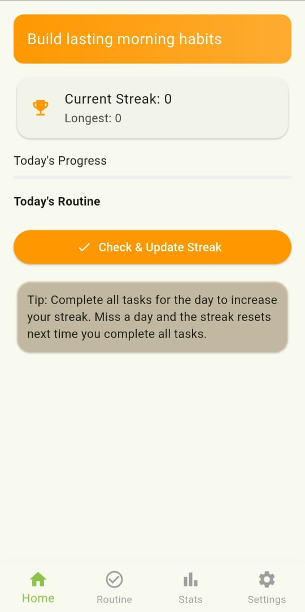
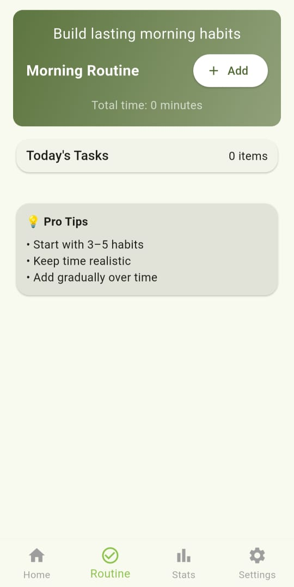
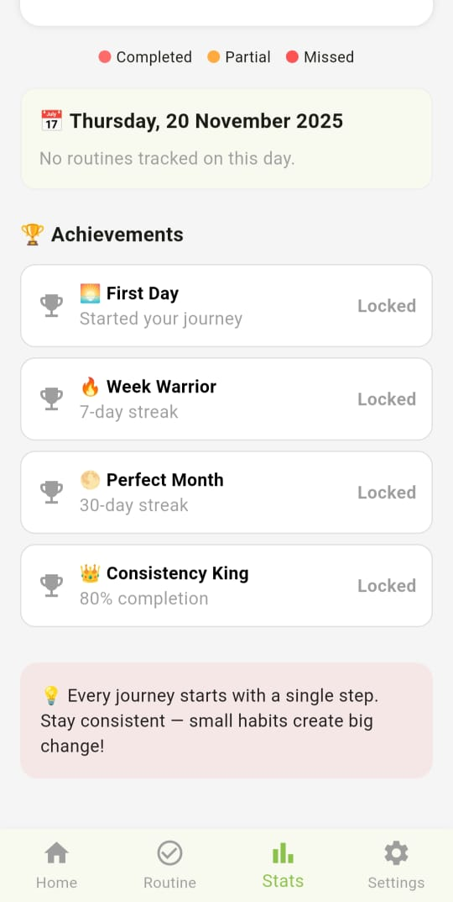
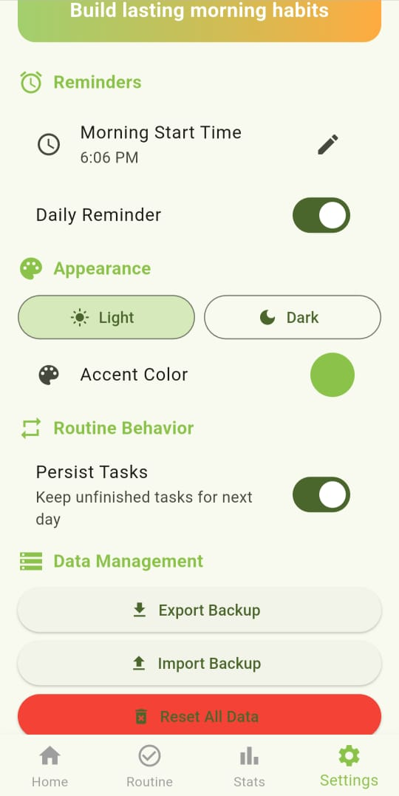

# Morning Routine
Help users build consistent morning habits by tracking routines, streaks, and progress — fully offline, lightweight, and gamified for motivation.

## Table of Contents  
- [About](#about)  
- [Features](#features)  
- [Screenshots](#screenshots)  
- [Getting Started](#getting-started)  
  - [Prerequisites](#prerequisites)  
  - [Installation](#installation)    
- [Contact](#contact)  

## About  
Morning Routine Master is a mobile application designed to help you build and maintain productive morning habits. It enables you to define your own routine tasks, track streaks and progress, and enjoy a lightweight, offline-first experience with a gamified twist to keep you motivated.

## Features  
- Define custom morning routine tasks (e.g., “Meditation”, “Exercise”, “Read 10 minutes”)  
- Track completion per day and maintain streaks  
- Visual progress over time  
- Offline functionality — no network required for daily tracking  
- Lightweight and fast: minimal setup and low overhead  
- Gamified motivation: reward yourself for consistency  
- Cross-platform (iOS & Android) [adjust if needed]

## Screenshots  
*Insert screenshots here (homepage, task list, streak view, settings)*  






## Getting Started  

### Prerequisites  
- Flutter SDK (or specify if using native frameworks)  
- Xcode for iOS / Android Studio for Android  
- A compatible device or emulator  

### Installation  
1. Clone the repository:  
     ```bash  
     git clone https://github.com/divmkw/morning_routine.git  
     cd morning_routine  

2. Install dependencies:
     ```bash
     flutter pub get   

3. Build & run:
     ```bash
     flutter run
 
